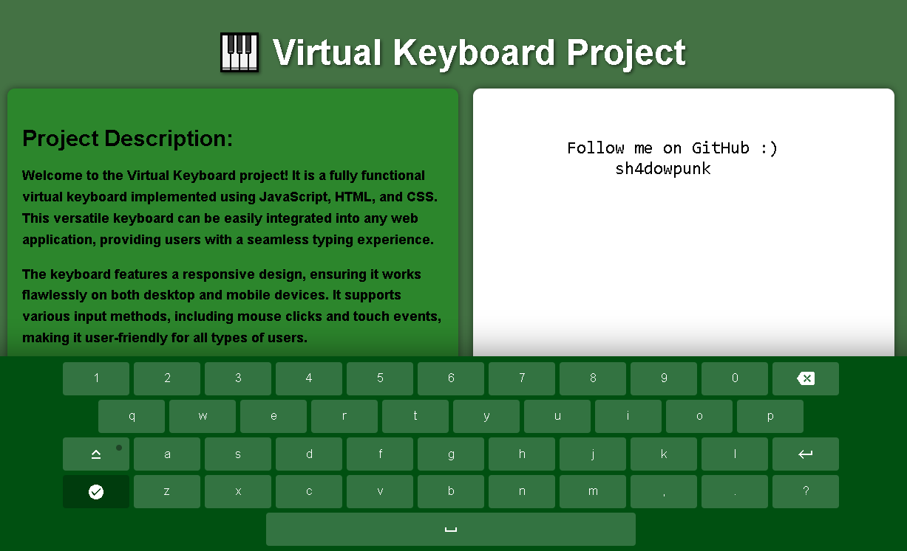

# Virtual Keyboard Project 🎹

Welcome to the Virtual Keyboard project! It is a fully functional virtual keyboard implemented using JavaScript, HTML, and CSS. This versatile keyboard can be easily integrated into any web application, providing users with a seamless typing experience.

## Project Description:

The keyboard features a responsive design, ensuring it works flawlessly on both desktop and mobile devices. It supports various input methods, including mouse clicks and touch events, making it user-friendly for all types of users.

## Getting Started:

1. Clone this repository to your local machine using `git clone https://github.com/your-username/your-repository.git`
2. Open the `index.html` file in your web browser.

## Features:

- Fully functional virtual keyboard
- Responsive design for mobile and desktop
- Supports various input methods

## License:

This project is licensed under the [MIT License](LICENSE).

---
Feel free to contribute to this project. If you encounter any issues or have suggestions, please create an issue or a pull request.
